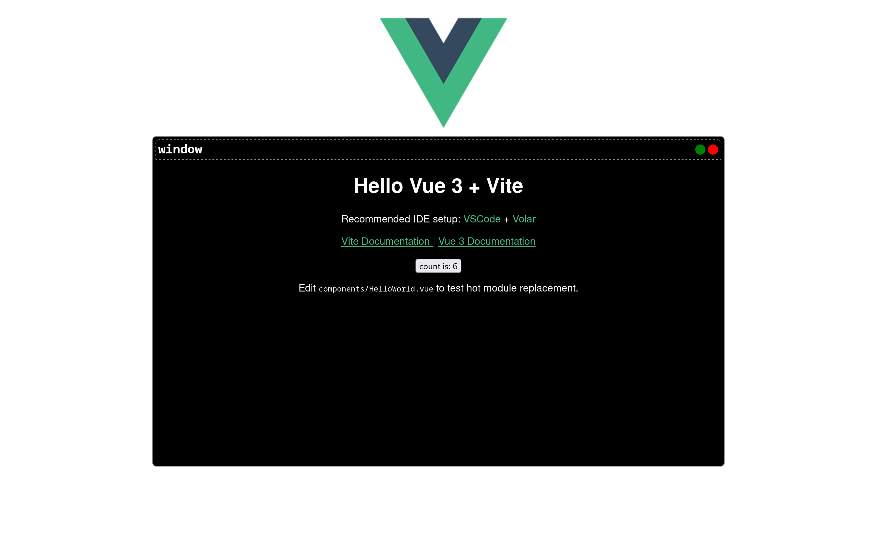

# vue-window

Vue 3 window component

[demo](https://moody-person.github.io/vue-window-component/)



## Installation

``` sh
npm i vue-window-component
```

## Usage

``` vue
<script setup>
import HelloWorld from "./components/HelloWorld.vue";
import { VWindow } from "vue-window-component";
</script>

<template>
  <v-window title="window">
    <HelloWorld msg="Hello Vue 3 + Vite" />
  </v-window>
</template>
```
